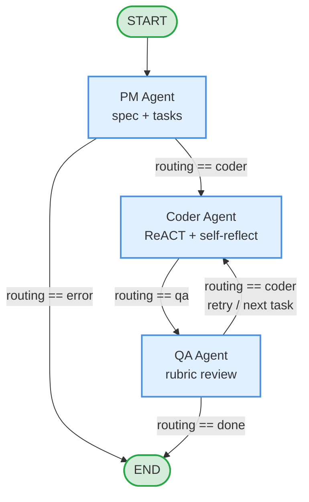
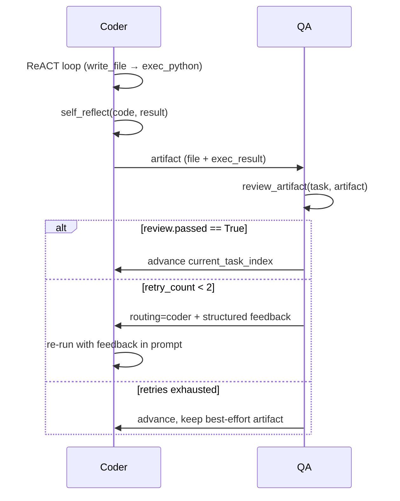
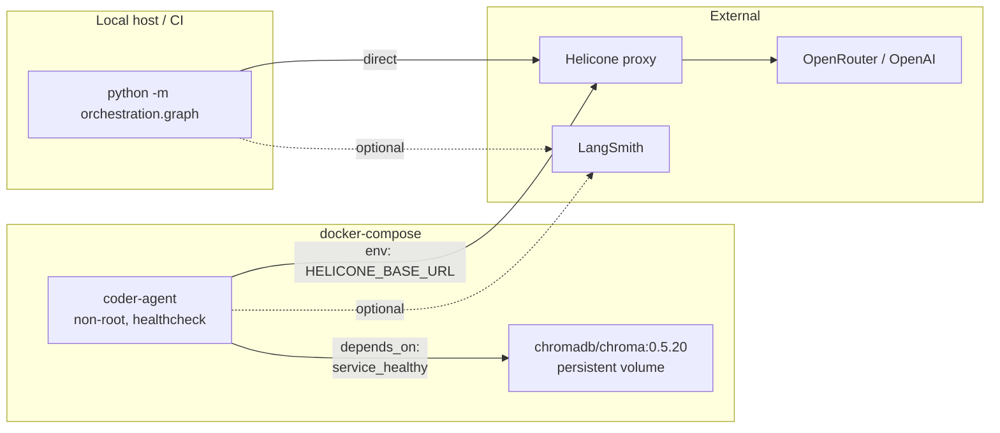

# Architecture — Multi-Agent Dev Team

> Capstone for *Build Autonomous Multi-Agent Systems* (Saras AI Institute,
> Spring 2026). This document is the canonical architectural reference for
> the project. The README's "Previous milestone" sections preserve the
> chronological week-by-week narrative.

## Contents

1. [System overview](#system-overview)
2. [Pipeline diagram](#pipeline-diagram)
3. [Agent roles](#agent-roles)
4. [Shared state (`ProjectState`)](#shared-state-projectstate)
5. [Cross-cutting concerns](#cross-cutting-concerns)
6. [Innovations](#innovations)
7. [Framework justification](#framework-justification)
8. [Operational topology](#operational-topology)

---

## System overview

The system is an autonomous software-development team that takes a single
natural-language requirement and emits one or more verified Python files.
Three role-specialised agents collaborate over a shared `ProjectState`:

- **PM Agent** turns a requirement into a tech spec and a coding task list.
- **Coder Agent** implements one task at a time with a ReACT loop and a
  self-critique pass before submitting.
- **QA Agent** reviews each artifact, sending the Coder back with structured
  feedback for up to two retries.

Around the agents sit production-grade primitives: structured logging with
distributed `run_id` propagation, per-agent token + USD cost tracking, a
retry-with-backoff decorator, a circuit breaker with the standard three-state
machine, a pipeline-level timeout watchdog, and a SHA-256 keyed response
cache. ChromaDB provides long-term semantic memory; an MCP-style adapter
exposes the file/exec tools through a registry contract; an A2A module
defines a five-field message schema with a validating broker for peer
communication.

## Pipeline diagram



The graph is a `langgraph.graph.StateGraph` whose nodes are pure-function
adapters around each agent. Edges are conditional: each node returns a
`routing` field that the router function reads to decide where the next
state goes. Self-loops on `coder` (driven by QA verdicts) allow per-task
retries without growing the graph topology.

### Coder ⇄ QA review loop



## Agent roles

### PM Agent (`agents/pm_agent.py`)

| Responsibility | Detail |
|---|---|
| Build tech spec | Single LLM call → Markdown with five required sections (Overview, Functional, Non-Functional, File Structure, Constraints). |
| Decompose into tasks | Single LLM call → JSON array of `CodingTask` dicts. Tolerates accidental markdown fences; returns `[]` on parse failure (graph routes to error). |
| Cap task count | If decomposition produces more than `MAX_TASKS_PER_REQUIREMENT` (8) tasks, runs a consolidation pass that merges related items. Falls back to the original list when consolidation is malformed or fails to actually shorten the list. |
| Optional debate | When `PM_DEBATE_MODE=true`, runs a three-call debate (simplicity advocate + completeness advocate + synthesiser) instead of the single spec call. See [Innovations](#innovations). |

### Coder Agent (`agents/coder_agent.py`)

| Responsibility | Detail |
|---|---|
| ReACT loop | LangGraph subgraph: `agent ↔ tools` with `MAX_ITERATIONS = 10`. The agent calls `write_file` then `exec_python` to verify; tool outputs are truncated at 2000 chars to protect the context window. |
| Self-reflection | Reflexion-style pass after the loop: the model critiques its own code. If `needs_revision=true` and a `revised_code` payload is provided, the artifact is replaced before reaching QA. Critique is appended to `AgentOutput.explanation`. |
| Memory | Top-3 long-term memories retrieved by cosine similarity on the task string, injected into the system prompt. After every run, a one-line summary (`Task: …\nOutcome: …`) is stored back. |
| QA-feedback retries | When the prior turn failed QA, the next instruction includes the review's `issues` and `suggestions` so the model can fix them concretely. |

### QA Agent (`agents/qa_agent.py`)

| Responsibility | Detail |
|---|---|
| Rubric review | Single LLM call → `QAReview` JSON: `passed`, `issues`, `suggestions`, `summary`. Reviewers four axes: correctness, safety, style, execution. |
| Routing decision | Pass → advance task index. Fail with retries available → loop back to Coder. Fail with retries exhausted → advance, preserve best-effort artifact. |
| Graceful degradation | Malformed review JSON defaults to `passed=true` with a clear summary so a transient parse failure doesn't block forward progress. |

## Shared state (`ProjectState`)

```python
class ProjectState(TypedDict):
    user_requirement:   str                            # Input
    tech_spec:          str                            # PM → state
    tasks:              Annotated[list[CodingTask], add]
    artifacts:          Annotated[list[CodingArtifact], add]
    reviews:            Annotated[list[QAReview], add]
    current_task_index: int
    retry_count:        int
    routing:            str
    error:              str
    run_id:             str
```

Three list fields use `operator.add` as a reducer — LangGraph appends new
items to the existing list rather than overwriting, which is what makes the
QA-then-coder loop safe under partial state updates. Scalar fields
(`current_task_index`, `retry_count`, `routing`) are overwritten each turn.

## Cross-cutting concerns

| Concern | Module | What it gives you |
|---|---|---|
| Logging | `observability/logging.py` | JSON formatter; per-agent loggers; `bind_run_context` for trace correlation. |
| Tracing | `observability/tracing.py` | `new_run_id()`; `trace_span` context manager that emits `span_start` / `span_end` / `span_error` log events with duration. |
| Cost | `observability/cost.py` | `TokenUsage` dataclass; `CostTracker` aggregator; per-run registry (`tracker_for(run_id)`); `write_report(run_id, dir)` writes a per-run JSON to `docs/cost_reports/`. |
| Retry | `resilience/retry.py` | `retry_with_backoff` decorator with full jitter; retries `TransientError` only — `PermanentError` short-circuits. |
| Circuit breaker | `resilience/circuit_breaker.py` | CLOSED / OPEN / HALF-OPEN state machine; configurable `failure_threshold` and `cool_down`; raises `DegradableError` while open. |
| Timeout | `resilience/timeout.py` | `with_timeout(callable, timeout_s)` watchdog. |
| Caching | `caching/response_cache.py` | SHA-256 keyed cache with TTL; tracks hits/misses for hit-rate measurement. |
| Memory | `memory.py` | `SlidingWindowBuffer` (FIFO short-term) + `SemanticMemory` (Chroma; auto-detects `CHROMA_HOST` env var to use HttpClient under Docker). |
| MCP adapter | `tools/mcp_adapter.py` | `TOOL_REGISTRY` + `list_tools()` + `call_tool(name, args)`; in-process equivalent of MCP's `tools/list` + `tools/call`. |
| A2A protocol | `orchestration/a2a.py` | Five-field `Message` dataclass with sender/intent validation; `Broker` with per-agent `asyncio.Queue`; `AGENT_CAPABILITIES` advertisement; `validate_incoming` trust-boundary check. |

## Innovations

### Innovation 1 — Cost optimisation with measured data

Per-agent model selection is configurable via `config.AGENT_MODELS` and per-
agent env vars (`MODEL_PM`, `MODEL_CODER`, `MODEL_QA`). A baseline run with
all agents on `gpt-4o` is compared to a tuned run with PM on `gpt-4o` and
Coder/QA on `gpt-4o-mini`; results are captured under
`docs/cost_reports/<run_id>.json` and summarised in `docs/test_results.md`.
The tracker also records cached prompt tokens (when the provider returns
`prompt_tokens_details.cached_tokens`) so cost reductions from response
cache hits show up explicitly.

### Innovation 2 — PM debate / consensus layer

When `PM_DEBATE_MODE=true`, the PM phase runs three LLM calls instead of
one (`agents/pm_debate.py`):

1. *Advocate for simplicity* — drafts the leanest possible spec.
2. *Advocate for completeness* — drafts a spec that resolves every edge case.
3. *Synthesiser* — reads both drafts and produces a single spec, with inline
   notes explaining where the two were merged or where one was preferred.

The synthesised spec then flows into the same `decompose_into_tasks` call as
the standard path. On ambiguous requirements the debate produces noticeably
better-justified specs (the synthesiser's "## Synthesis notes" subsection
makes the trade-offs auditable). Disabled by default so single-call cost
remains the floor.

## Framework justification

Three frameworks were realistic candidates for this project: **LangGraph**,
**AutoGen**, and **CrewAI**.

| Criterion | LangGraph | AutoGen | CrewAI |
|---|---|---|---|
| Inspectable control flow | Explicit nodes + edges; conditional routing is a function on state. | Implicit through chat-room dynamics. | Role-and-task model is opinionated but less explicit per-edge. |
| Tool-calling ergonomics | First-class `ToolNode` + `bind_tools`. | Function-calling supported but framework adds extra layers. | Tool integration via `@tool` decorator. |
| Distributed tracing fit | LangSmith integration is native; `@traceable` wrappers are trivial. | Possible but requires more glue. | Possible but less mature. |
| Course alignment | Course Week 2 builds the multi-agent graph in LangGraph. | Out-of-scope for this course. | Out-of-scope for this course. |
| Maturity / Python-native | Stable Python API; small surface area. | Mature; broader scope. | Newer; smaller community. |

**LangGraph wins on three axes that mattered most for this capstone**:
inspectable control flow (every edge is debuggable), tool-calling ergonomics
(no parser code), and direct fit to the course material. The decision held
up through Weeks 2–5: adding the QA agent in Week 3, the production
primitives in Week 4, and the polish in Week 5 each touched only the
graph builder and one agent module.

The trade-off is that LangGraph's state-reducer model demands more thought
than AutoGen's chat room. The reducer for `tasks: Annotated[list, add]` is
load-bearing — if it were a plain `list`, the QA-then-coder loop would
overwrite the task list each turn and the pipeline would deadlock. Catching
that is what makes LangGraph's explicitness an advantage rather than a
ceremony.

## Operational topology



- The agent container runs as a non-root `agent` user with a healthcheck that
  imports the compiled graph (so an unhealthy install fails fast).
- The Chroma container holds long-term semantic memory in a named volume
  (`chroma-data`) so memory survives `docker compose down` (without `-v`).
- `docs/cost_reports/` is bind-mounted into the agent container so reports
  produced inside Docker show up on the host filesystem.
- LangSmith tracing is opt-in: set `LANGCHAIN_TRACING_V2=true` and the
  related `LANGCHAIN_*` env vars, and every node will appear as a span under
  one root run.

---

*Last updated: Week 5 polish (2026-05-01). For the chronological week-by-week
record, see the README's "Previous milestone" sections. For run cost data,
see `docs/cost_reports/`. For the post-mortem, see `docs/REFLECTION.md`.*
